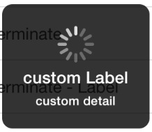
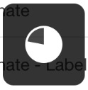
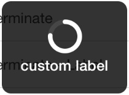
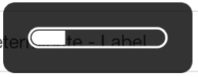
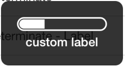

# Cordova Progress-Indicator Plugin#
This plugin allows you to show a native Progress Indicator on iOS - by [Paolo Bernasconi](https://github.com/pbernasconi)

There are several types of indicators available:

* [Simple](http://pbernasconi.github.io/cordova-progressIndicator/#simple)
* [Determinate](http://pbernasconi.github.io/cordova-progressIndicator/#determinate)
* [Annular](http://pbernasconi.github.io/cordova-progressIndicator/#annular)
* [Bar](http://pbernasconi.github.io/cordova-progressIndicator/#bar)
* [Success](http://pbernasconi.github.io/cordova-progressIndicator/#others)
* [Simple Text](http://pbernasconi.github.io/cordova-progressIndicator/#others)

# Install

```
cordova plugin add org.pbernasconi.progressindicator
```

# [View the Docs](http://pbernasconi.github.io/cordova-progressIndicator/)

The Docs are situated at [http://pbernasconi.github.io/cordova-progressIndicator/](http://pbernasconi.github.io/cordova-progressIndicator/)


## Screenshots

iOS


|Simple|Label|Label-Detail|Success|Text Top|Text Botom|
|------|-----|------------|-------|--------|----------|
||||||


|Determinate|Determinate Label|Annular|Annular Label|Bar|Bar Label|
|-----------|-----------------|-------|-------------|---|---------
||||||


### CREDITS

 - [MBProgressHUD](https://github.com/jdg/MBProgressHUD)
 - [Cordova-ActivityIndicator](https://github.com/Initsogar/cordova-activityindicator)
 - 
 
#### License

Apache license 2.0 - Use this plugin for any production / development needs, and if you'd like to make an attribution to me somewhere.
