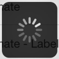
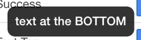

# Cordova Progress-Indicator Plugin#
Plugin for Cordova 3.0+ that allows you to show a loading spinner and a message in your Android/iOS Cordova's app - by [Paolo Bernasconi](https://github.com/pbernasconi)


## 0. Index

1. [Description](#1-description)
2. [Screenshots](#2-screenshots)
3. [Installation](#3-installation)
4. [Usage](#4-usage)
5. [Changelog](#5-changelog)
6. [Credits](#6-credits)
7. [License](#7-license)


## 1. Description

This plugin allows you to show a native Toast (a little text popup) on iOS, Android and WP8.
It's great for showing a non intrusive native notification which is guaranteed always in the viewport of the browser.
* You can choose where to show the Toast: at the top, center or bottom of the screen.
* You can choose two durations: short (approx. 2 seconds), or long (approx. 5 seconds), after which the Toast automatically disappears.
* Compatible with [Cordova Plugman](https://github.com/apache/cordova-plugman).
* Officially supported by [PhoneGap Build](https://build.phonegap.com/plugins).
* Minimum iOS version is [6](https://github.com/EddyVerbruggen/Toast-PhoneGap-Plugin/issues/7).

Example usages:
* "There were validation errors"
* "Account created successfully"
* "The record was deleted"
* "Login successful"
* "The battery is almost dead"
* "You are now logged out"
* "Connection failure, please try again later"


## 2. Screenshots

iOS


|Simple|Label|Label-Detail|
|------|-----|------------|
||||

|Determinate|Determinate Label|
|---|---|
||


|Annular|Annular Label|
|---|---|
||


|Bar|Bar Label|
|---|---|
||

|Success|Text Top|Text Botom|
|---|---|--|
|||

## 3. Installation

### Automatically (CLI / Plugman)
To install the ProgressIndicator Plugin you can use Cordova or Phonegap.

```
$ cordova plugin add https://github.com/pbernasconi/cordova-progressIndicator.git
```


```
$ phonegap local plugin add https://github.com/pbernasconi/cordova-progressIndicator.git
```


## 4. Usage


#### Simple

```
ProgressIndicator.showSimple(true);
```


### 5. CHANGELOG

1.0: initial version supporting iOS

### 6. CREDITS

 - [MBProgressHUD](https://github.com/jdg/MBProgressHUD)
 - [Cordova-ActivityIndicator](https://github.com/Initsogar/cordova-activityindicator)


### 7. License

[The MIT License (MIT)](http://www.opensource.org/licenses/mit-license.html)

Permission is hereby granted, free of charge, to any person obtaining a copy
of this software and associated documentation files (the "Software"), to deal
in the Software without restriction, including without limitation the rights
to use, copy, modify, merge, publish, distribute, sublicense, and/or sell
copies of the Software, and to permit persons to whom the Software is
furnished to do so, subject to the following conditions:

The above copyright notice and this permission notice shall be included in
all copies or substantial portions of the Software.

THE SOFTWARE IS PROVIDED "AS IS", WITHOUT WARRANTY OF ANY KIND, EXPRESS OR
IMPLIED, INCLUDING BUT NOT LIMITED TO THE WARRANTIES OF MERCHANTABILITY,
FITNESS FOR A PARTICULAR PURPOSE AND NONINFRINGEMENT. IN NO EVENT SHALL THE
AUTHORS OR COPYRIGHT HOLDERS BE LIABLE FOR ANY CLAIM, DAMAGES OR OTHER
LIABILITY, WHETHER IN AN ACTION OF CONTRACT, TORT OR OTHERWISE, ARISING FROM,
OUT OF OR IN CONNECTION WITH THE SOFTWARE OR THE USE OR OTHER DEALINGS IN
THE SOFTWARE.


## Adding the plugin to your project ##
To install the plugin, use the Cordova CLI and enter the following:<br />
`cordova plugin add https://github.com/Initsogar/cordova-activityindicator`

## Platforms ##
- Android
- iOS

## Use ##
To show the dialog, use the following code:<br />
`ActivityIndicator.show(message)`


To hide the dialog, use the following code:<br />
`ActivityIndicator.hide()`

## Credits ##
This plugin is inspired in the following projects:<br />
https://github.com/jdg/MBProgressHUD<br />
https://github.com/pebois/phonegap-plugin-ProgressHUD<br />
https://github.com/bormansquirrel/WaitingDialog


